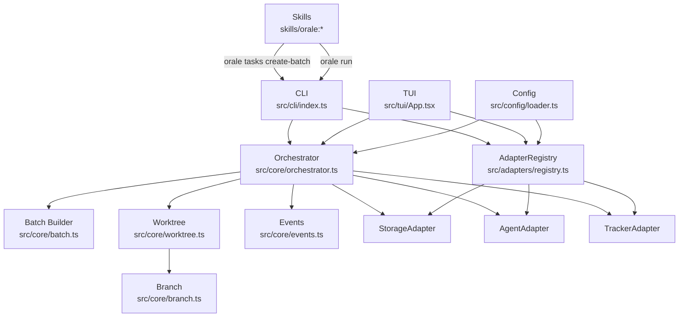

# Architecture

System layers and primary data flows.

```mermaid
graph TD
    CLI["CLI\nsrc/cli/index.ts"]
    TUI["TUI\nsrc/tui/App.tsx"]
    ORC["Orchestrator\nsrc/core/orchestrator.ts"]
    BAT["Batch Builder\nsrc/core/batch.ts"]
    WTR["Worktree\nsrc/core/worktree.ts"]
    BRN["Branch\nsrc/core/branch.ts"]
    EVT["Events\nsrc/core/events.ts"]
    REG["AdapterRegistry\nsrc/adapters/registry.ts"]
    STO["StorageAdapter"]
    AGT["AgentAdapter"]
    TRK["TrackerAdapter"]
    SKL["Skills\nskills/orale:*"]
    CFG["Config\nsrc/config/loader.ts"]

    CLI --> ORC
    CLI --> REG
    TUI --> REG
    TUI --> ORC
    ORC --> BAT
    ORC --> WTR
    ORC --> EVT
    ORC --> AGT
    ORC --> STO
    ORC --> TRK
    WTR --> BRN
    REG --> STO
    REG --> AGT
    REG --> TRK
    CFG --> REG
    CFG --> ORC
    SKL -->|"orale tasks create-batch"| CLI
    SKL -->|"orale run"| CLI
```
