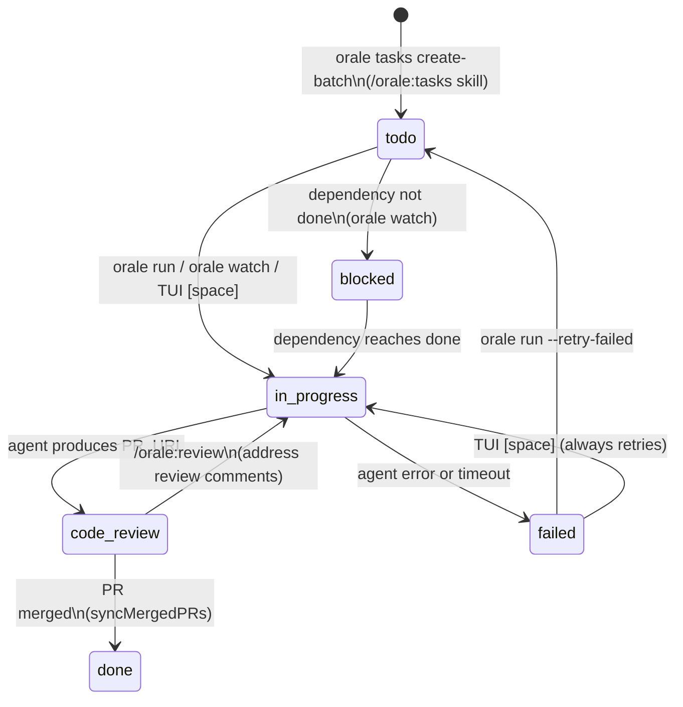

# Task Lifecycle

All task status transitions and who drives each edge.

```mermaid
stateDiagram-v2
    [*] --> todo : orale tasks create-batch\n(/orale:tasks skill)

    todo --> in_progress : orale run / orale watch / TUI [space]
    in_progress --> code_review : agent produces PR_URL
    in_progress --> failed : agent error or timeout

    failed --> todo : orale run --retry-failed
    failed --> in_progress : TUI [space] (always retries)

    code_review --> done : PR merged\n(syncMergedPRs)
    code_review --> in_progress : /orale:review\n(address review comments)

    todo --> blocked : dependency not done\n(orale watch)
    blocked --> in_progress : dependency reaches done
```
