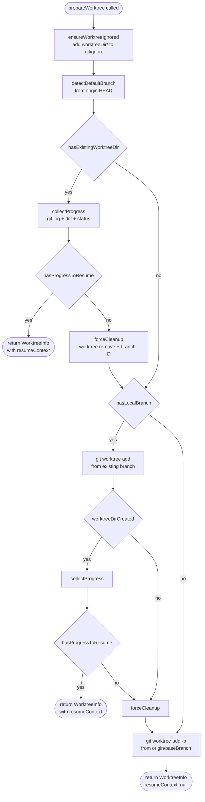

# Worktree Flow

`prepareWorktree` resolution — three cases based on existing git state.

```mermaid
flowchart TD
    A([prepareWorktree called]) --> B[ensureWorktreeIgnored\nadd worktreeDir/ to .gitignore]
    B --> C[detectDefaultBranch\nfrom origin HEAD]
    C --> D{hasExistingWorktreeDir}

    D -->|yes| E[collectProgress\ngit log + diff + status]
    E --> F{hasProgressToResume}
    F -->|yes| G([return WorktreeInfo\nwith resumeContext])
    F -->|no| H[forceCleanup\nworktree remove + branch -D]

    D -->|no| I{hasLocalBranch}
    H --> I

    I -->|yes| J[git worktree add\nfrom existing branch]
    J --> K{worktreeDirCreated}
    K -->|yes| L[collectProgress]
    L --> M{hasProgressToResume}
    M -->|yes| N([return WorktreeInfo\nwith resumeContext])
    M -->|no| O[forceCleanup]
    K -->|no| O
    O --> P

    I -->|no| P[git worktree add -b\nfrom origin/baseBranch]
    P --> Q([return WorktreeInfo\nresumeContext: null])
```
