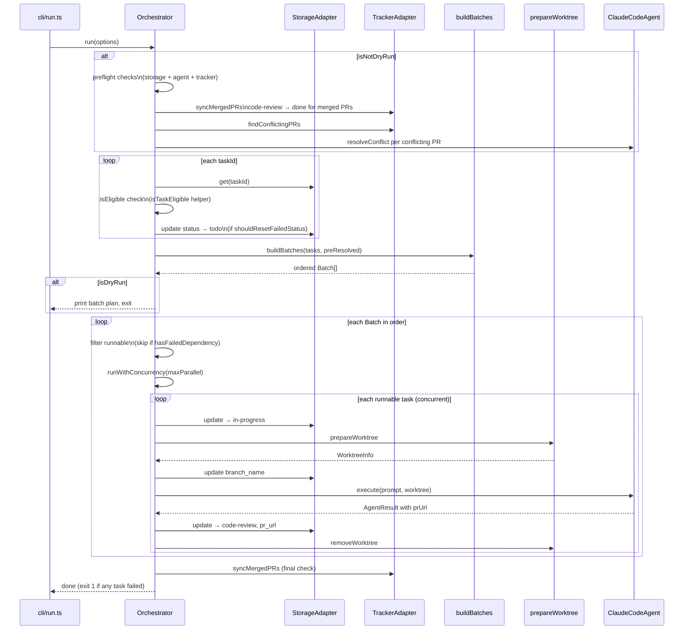

# orale run

End-to-end sequence from CLI invocation to task completion.

```mermaid
sequenceDiagram
    participant CLI as cli/run.ts
    participant ORC as Orchestrator
    participant STO as StorageAdapter
    participant TRK as TrackerAdapter
    participant BAT as buildBatches
    participant WTR as prepareWorktree
    participant AGT as ClaudeCodeAgent

    CLI->>ORC: run(options)

    alt isNotDryRun
        ORC->>ORC: preflight checks\n(storage + agent + tracker)
        ORC->>TRK: syncMergedPRs\ncode-review → done for merged PRs
        ORC->>TRK: findConflictingPRs
        ORC->>AGT: resolveConflict per conflicting PR
    end

    loop each taskId
        ORC->>STO: get(taskId)
        ORC->>ORC: isEligible check\n(isTaskEligible helper)
        ORC->>STO: update status → todo\n(if shouldResetFailedStatus)
    end

    ORC->>BAT: buildBatches(tasks, preResolved)
    BAT-->>ORC: ordered Batch[]

    alt isDryRun
        ORC-->>CLI: print batch plan, exit
    end

    loop each Batch in order
        ORC->>ORC: filter runnable\n(skip if hasFailedDependency)
        ORC->>ORC: runWithConcurrency(maxParallel)

        loop each runnable task (concurrent)
            ORC->>STO: update → in-progress
            ORC->>WTR: prepareWorktree
            WTR-->>ORC: WorktreeInfo
            ORC->>STO: update branch_name
            ORC->>AGT: execute(prompt, worktree)
            AGT-->>ORC: AgentResult with prUrl
            ORC->>STO: update → code-review, pr_url
            ORC->>WTR: removeWorktree
        end
    end

    ORC->>TRK: syncMergedPRs (final check)
    ORC-->>CLI: done (exit 1 if any task failed)
```
