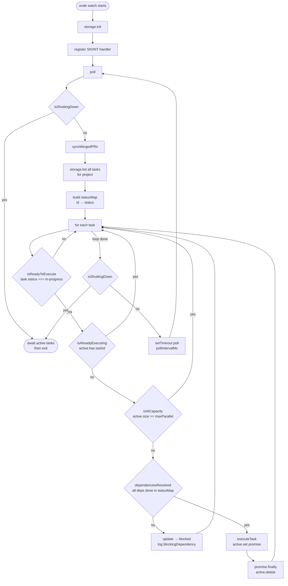

# orale watch

Daemon polling loop for continuous task execution.

```mermaid
flowchart TD
    A([orale watch starts]) --> B[storage.init]
    B --> C[register SIGINT handler]
    C --> D[poll]

    D --> E{isShuttingDown}
    E -->|yes| Z([await active tasks\nthen exit])

    E -->|no| F[syncMergedPRs]
    F --> G[storage.list all tasks\nfor project]
    G --> H[build statusMap\nid → status]

    H --> I[for each task]
    I --> J{isReadyToExecute\ntask.status === in-progress}
    J -->|no| I

    J -->|yes| K{isAlreadyExecuting\nactive.has taskId}
    K -->|yes| I

    K -->|no| L{isAtCapacity\nactive.size >= maxParallel}
    L -->|yes| I

    L -->|no| M{dependenciesResolved\nall deps done in statusMap}
    M -->|no| N[update → blocked\nlog blockingDependency]
    N --> I

    M -->|yes| O[executeTask\nactive.set promise]
    O --> P[promise.finally\nactive.delete]
    P --> I

    I -->|loop done| Q{isShuttingDown}
    Q -->|no| R[setTimeout poll\npollIntervalMs]
    R --> D
    Q -->|yes| Z
```
