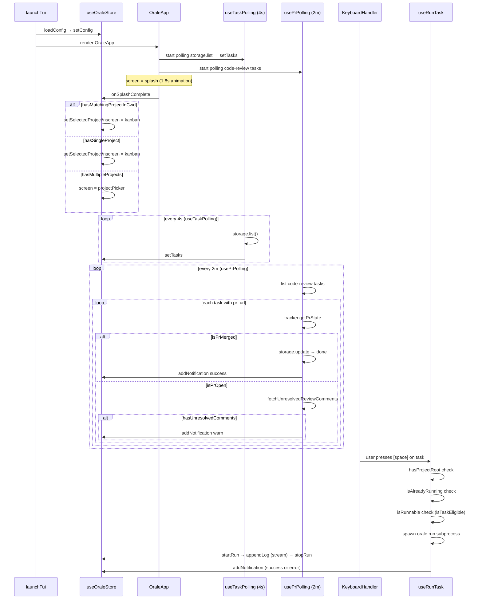

# TUI Flow

Startup sequence, hook wiring, and user action paths.

```mermaid
sequenceDiagram
    participant Main as launchTui
    participant Store as useOraleStore
    participant App as OraleApp
    participant TP as useTaskPolling (4s)
    participant PP as usePrPolling (2m)
    participant KB as KeyboardHandler
    participant RT as useRunTask

    Main->>Store: loadConfig → setConfig
    Main->>App: render OraleApp

    App->>TP: start polling storage.list → setTasks
    App->>PP: start polling code-review tasks

    Note over App: screen = splash (1.8s animation)

    App->>Store: onSplashComplete

    alt hasMatchingProjectInCwd
        Store->>Store: setSelectedProject\nscreen = kanban
    else hasSingleProject
        Store->>Store: setSelectedProject\nscreen = kanban
    else hasMultipleProjects
        Store->>Store: screen = projectPicker
    end

    loop every 4s (useTaskPolling)
        TP->>TP: storage.list()
        TP->>Store: setTasks
    end

    loop every 2m (usePrPolling)
        PP->>PP: list code-review tasks
        loop each task with pr_url
            PP->>PP: tracker.getPrState
            alt isPrMerged
                PP->>PP: storage.update → done
                PP->>Store: addNotification success
            else isPrOpen
                PP->>PP: fetchUnresolvedReviewComments
                alt hasUnresolvedComments
                    PP->>Store: addNotification warn
                end
            end
        end
    end

    KB->>RT: user presses [space] on task
    RT->>RT: hasProjectRoot check
    RT->>RT: isAlreadyRunning check
    RT->>RT: isRunnable check (isTaskEligible)
    RT->>RT: spawn orale run subprocess
    RT->>Store: startRun → appendLog (stream) → stopRun
    RT->>Store: addNotification (success or error)
```
