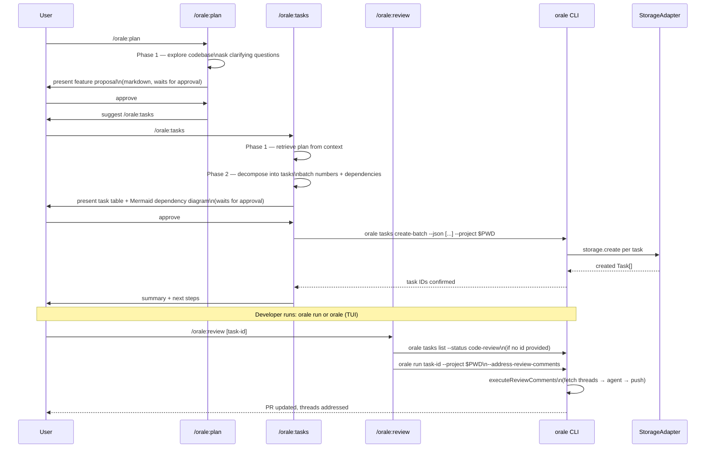

# Skills Flow

Three-skill workflow from planning to addressing review comments.

```mermaid
sequenceDiagram
    participant User
    participant Plan as /orale:plan
    participant Tasks as /orale:tasks
    participant Review as /orale:review
    participant CLI as orale CLI
    participant STO as StorageAdapter

    User->>Plan: /orale:plan
    Plan->>Plan: Phase 1 — explore codebase\nask clarifying questions
    Plan->>User: present feature proposal\n(markdown, waits for approval)
    User->>Plan: approve
    Plan->>User: suggest /orale:tasks

    User->>Tasks: /orale:tasks
    Tasks->>Tasks: Phase 1 — retrieve plan from context
    Tasks->>Tasks: Phase 2 — decompose into tasks\nbatch numbers + dependencies
    Tasks->>User: present task table + Mermaid dependency diagram\n(waits for approval)
    User->>Tasks: approve
    Tasks->>CLI: orale tasks create-batch --json [...] --project $PWD
    CLI->>STO: storage.create per task
    STO-->>CLI: created Task[]
    CLI-->>Tasks: task IDs confirmed
    Tasks->>User: summary + next steps

    Note over User,CLI: Developer runs: orale run or orale (TUI)

    User->>Review: /orale:review [task-id]
    Review->>CLI: orale tasks list --status code-review\n(if no id provided)
    Review->>CLI: orale run task-id --project $PWD\n--address-review-comments
    CLI->>CLI: executeReviewComments\n(fetch threads → agent → push)
    CLI-->>User: PR updated, threads addressed
```
