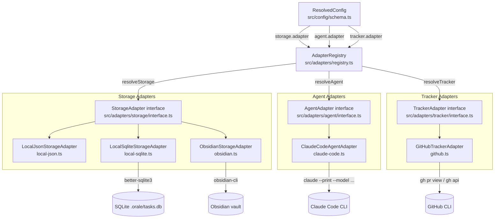

# Adapter System

Config-driven resolution from `ResolvedConfig` through `AdapterRegistry` to concrete implementations.

## Adding a new adapter

1. Add the adapter key to the union in `src/config/schema.ts`
2. Create `src/adapters/<type>/<name>.ts` implementing the interface
3. Register it in `createDefaultRegistry` in `src/adapters/registry.ts`
