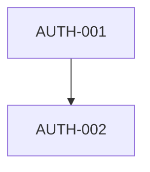

# orale:tasks

Decompose an approved feature plan into autonomous tasks with dependency ordering, then create them in the configured storage adapter via the orale CLI.

## Trigger

The user runs `/orale:tasks` from any project directory (typically after `/orale:plan`).

---

## Workflow

### Phase 1 — Get the Plan

If the user just ran `/orale:plan`, the proposal is already in context. Otherwise, ask the user to describe the feature or paste the plan.

---

### Phase 2 — Decompose Into Tasks

Break the feature into autonomous tasks.

#### Task grouping principles (read carefully)

Each task becomes one PR. Optimise for **reviewability** over atomicity:

- **Group similar small changes** that belong to the same domain into a single task. Example: 5 file renames across the same module → 1 task, not 5. 4 import-path fixes across related utilities → 1 task.
- **Split tasks** only when changes are truly independent, touch different areas, or a combined PR would be hard to review.
- **Target 1–3 meaningful files per task** as a soft guide.
- **Aim to minimise total PR count** without losing independence. If two tasks would always be reviewed together anyway, they should be one task.

Each task must still:
- Be independently executable by a fresh Claude session with no prior context
- Have clear, testable acceptance criteria
- Not share files being modified by another task in the same batch (no merge conflicts within a batch)

#### Task IDs

Format: `{PREFIX}-{NNN}` (e.g. `AUTH-001`, `AUTH-002`)
- PREFIX: 3–5 uppercase letters derived from the feature name
- NNN: zero-padded three-digit number starting at 001

To check existing prefixes in the current storage, run:
```bash
npx orale-cli tasks list --json | jq -r '.[].id' | sed 's/-[0-9]*//' | sort -u
```

#### Batches and Dependencies

- `batch` number determines parallel execution group (lower = executes first)
- `dependencies` lists task IDs that must be `done` before this task runs
- Tasks in the same batch must have no dependencies on each other

#### Issue tracker tickets (Jira / Linear / GitHub Issues)

After presenting the decomposition, ask the user:

> "Do any of these tasks have associated issue tracker tickets (e.g. Jira, Linear)? If so, provide the ticket key for each task or group (e.g. `JAY-3636`). Tasks without a ticket will use `task/{ID}` as the branch name."

Use the answers to set `tracker_ticket` in each task.

#### PR strategy

**Always ask — even if the plan already mentions a strategy. The plan's value is a suggestion, not a confirmed decision.**

First, read the configured default and the plan's suggested strategy:

```bash
CONFIG_DEFAULT=$(cat .orale/config.json 2>/dev/null | jq -r '.execution.prStrategy // "pr-per-task"')
```

Then ask the user:

> "What PR strategy should orale use for this feature?
> (Configured default: **{CONFIG_DEFAULT}**. Plan suggests: **{strategy from plan if present}**.)
>
> **(1) PR per task → main** — each task gets its own PR directly to main.
> **(2) PR per task → integration branch** — each task PR targets an integration branch first; team reviews individually before merging to main.
> **(3) Local integration branch — one final PR** — all tasks work on a shared branch; one combined PR at the end.
>
> If (2) or (3): what should the integration branch be named? (e.g. `integration/auth-rework`)"

Set `pr_strategy` and `integration_branch` on **every task in the batch** based on the answer:
- Option 1: `pr_strategy: "pr-per-task"`, no `integration_branch`
- Option 2: `pr_strategy: "pr-per-task-to-integration"`, `integration_branch: "<name>"`
- Option 3: `pr_strategy: "local-integration"`, `integration_branch: "<name>"`

#### Presentation

Show the user a summary table and a Mermaid dependency diagram:

```
| ID        | Title                              | Batch | Ticket   | Dependencies     |
|-----------|------------------------------------|-------|----------|------------------|
| AUTH-001  | Create JWT service + login endpoint| 1     | JAY-3636  | —                |
| AUTH-002  | Write integration tests            | 2     | JAY-3637  | AUTH-001         |
```



**Wait for explicit user approval before proceeding.** Ask: "Does this decomposition look correct? Should I adjust any tasks before creating them?"

---

### Phase 3 — Create Tasks via orale CLI

After the user approves, serialize the tasks as JSON and call `orale tasks create-batch`.

#### Capture context

```bash
PROJECT_PATH=$PWD
FEATURE_TITLE="<User-friendly feature name>"
PREFIX="<UPPERCASE_PREFIX>"
FEATURE="${PREFIX} - ${FEATURE_TITLE}"
```

#### Build the JSON array

Construct a JSON array with one object per task:

```json
[
  {
    "id": "AUTH-001",
    "title": "Create JWT service and login endpoint",
    "status": "todo",
    "batch": 1,
    "dependencies": [],
    "project": "/path/to/project",
    "files_to_modify": ["src/auth/jwt.service.ts", "src/auth/types.ts"],
    "feature": "AUTH - JWT Authentication",
    "body": "## Context\n...\n\n## Instructions\n...\n\n## Files to Modify\n...\n\n## Acceptance Criteria\n- [ ] ...",
    "tracker_ticket": "JAY-3636",
    "pr_strategy": "pr-per-task",
    "integration_branch": "",
    "pr_url": "",
    "branch_name": "",
    "started_at": "",
    "completed_at": "",
    "error": "",
    "retry_hint": "",
    "tags": ["task", "orale"]
  }
]
```

#### Call orale CLI

```bash
npx orale-cli tasks create-batch --json '<json-array>' --project $PROJECT_PATH
```

The `orale` CLI will use the storage adapter configured in `.orale/config.json` (default: local-sqlite).

---

## Task Body Structure

Each task's `body` field must follow this structure (use `\n` for newlines in JSON):

```markdown
## Context
Why this task exists. What problem it solves. What the user expects.

## Instructions
Step-by-step implementation instructions detailed enough for a fresh Claude session:
1. ...
2. ...
3. ...

Mention specific files, functions, patterns, and conventions to follow.
Include any gotchas or constraints discovered during planning.

## Files to Modify
- `src/path/to/file.ts` — What changes here and why

## Acceptance Criteria
- [ ] Specific, verifiable outcome 1
- [ ] Specific, verifiable outcome 2
```

---

## Writing Good Instructions

The executor is a fresh Claude session with access to the project but no planning context. Write instructions that are:

- **Self-contained**: No "as discussed" or "as planned" references
- **Specific**: Name the exact files, functions, interfaces to touch
- **Ordered**: Steps in the right sequence
- **Testable**: Each acceptance criterion is verifiable

Avoid vague instructions like "implement the service". Write "Create `src/auth/jwt.service.ts` with a `JwtService` class that exports `sign(payload, expiresIn)` and `verify(token)` methods using the `jsonwebtoken` package."

---

## Completion

After the orale CLI confirms creation, report:

```
Created {N} tasks:
  Feature: {PREFIX} - {Feature Title}
  Tasks: {PREFIX}-001, {PREFIX}-002, ...

To execute all tasks in dependency order:
  npx orale-cli run {comma-separated IDs} --project {PROJECT_PATH}

To open the kanban dashboard:
   npx orale-cli
```
